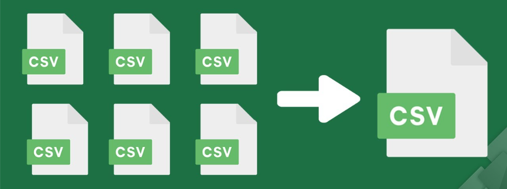
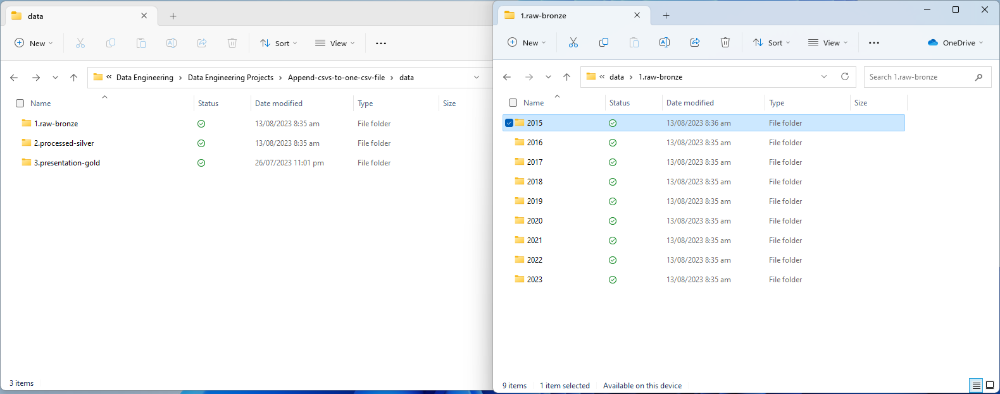
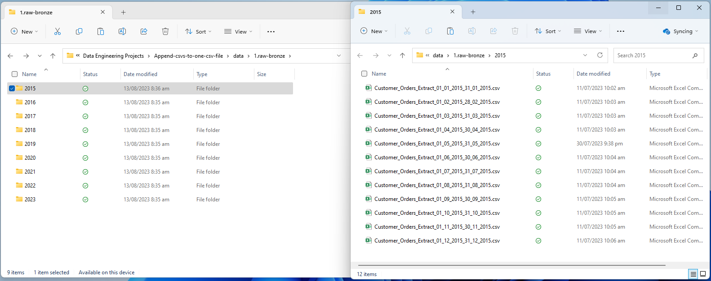
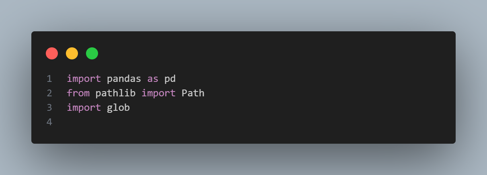
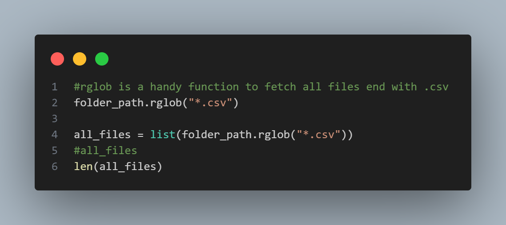
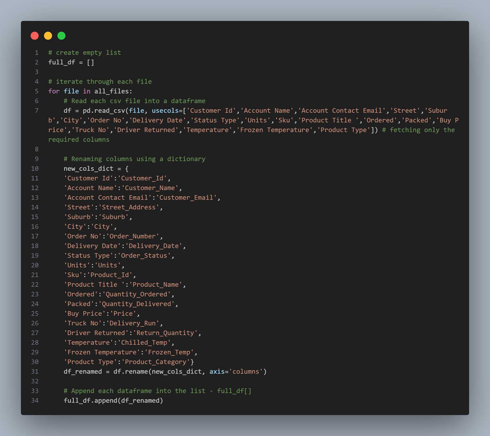
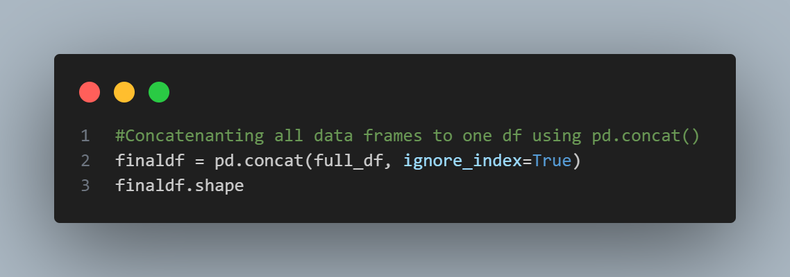

# Project Documentation: Combining and Analyzing Sales Data from CSV Files

## Table of Contents
    1 Introduction
    2 Project Overview
    3 Folder Structure
    4 Data Processing Workflow
    5 Prerequisites
    6 Installation
    7 Usage
    8 Conclusion
    9 Acknowledgments

## 1. Introduction
This documentation outlines the process of developing a Python project aimed at combining and analyzing sales data from multiple CSV files. The project utilizes the power of the **pandas, pathlib, glob, and rglob** libraries to efficiently process data and generate valuable insights. The main objective is to consolidate scattered data from 102 CSV files across 9 folders into a single master CSV file having 2.8+ million rows of data for further analysis in a logistic/delivery company.

## 2. Project Overview
The project revolves around creating a streamlined data processing pipeline that takes raw sales data, applies a standardized cleaning process, and ultimately presents the refined data in an easily analyzable format. This is achieved through a three-layer data structure: **Raw-Bronze, Processed-Silver, and Presentation-Gold**.

## 3. Folder Structure
The project adheres to a common data engineering folder structure:

-   **Raw-Bronze** (source folder for raw data)
    <ul>
    <li>    - Folder1</li>
    <li>    - Folder2</li>
    <li>    - ...</li>
    <li>    - Folder9</li>
    </ul>

 

-   **Processed-Silver** (intermediate processed data)
    -   Master_Sales_File.csv (final output file)
 

-   **Presentation-Gold** (final presentation layer, not covered in this project)

    -   The "Presentation-Gold" layer is the final stage in the data processing pipeline, focusing on refining the data for comprehensive analysis and reporting. While this specific layer is not covered in the current project documentation, it represents a critical component of the overall data workflow. In this layer, further cleaning, transformation, data profiling, and analysis preparation can be conducted to provide a polished and reliable dataset for complete analysis.

 

## 4. Data Processing Workflow
The data processing workflow involves the following steps:

#### 4.1. Retrieving CSV Files
Using the **pathlib** and **rglob** libraries, the script navigates through the Raw-Bronze folder structure to find all CSV files.

#### 4.2. Reading and Selecting Columns
For each CSV file, the script utilizes the **pandas** library to read the data into a DataFrame, selecting only 20 out of the original 36 columns using the **usecols** parameter in the **pd.read_csv** method.

#### 4.3. Concatenating DataFrames
Using **pd.concat**, all the individual DataFrames are combined into a single comprehensive DataFrame.

#### 4.4. Exporting Data
The final DataFrame is exported to a CSV file named "Master_Sales_File.csv," residing in the Processed-Silver folder. This file serves as the dataset for analysis.

 

## 5. Prerequisites
-   Python (>=3.6)
-   pandas library
-   pathlib library
-   glob library

## 8. Conclusion
This Python project demonstrates a powerful data processing pipeline using pandas, pathlib, glob, and rglob libraries. The automation of data consolidation and processing greatly improves efficiency and eliminates the need for manual labor, particularly in a scenario with a large volume of data.

## 9. Acknowledgments
This project owes its success to the valuable contributions of the open-source community behind the pandas, pathlib, and glob libraries. Their efforts have simplified and enhanced the data processing capabilities of Python.

**Source Code** - [Click here...](code_snippets/source-code.pdf)
